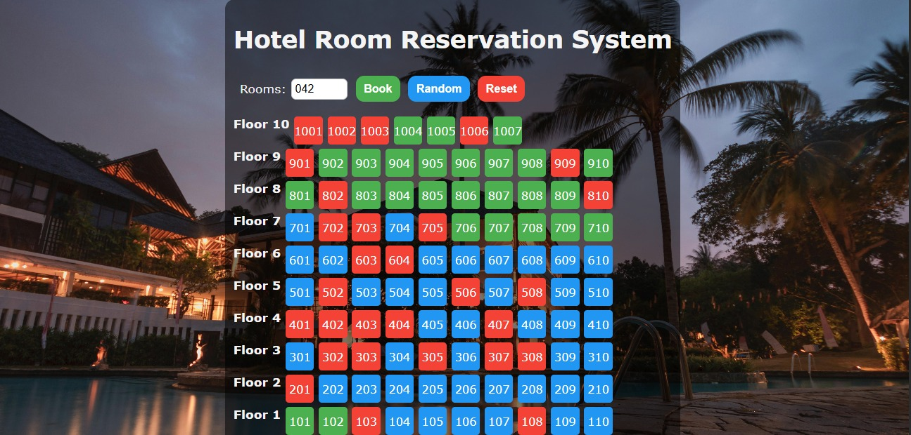
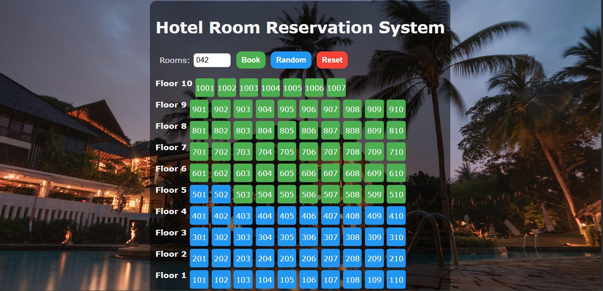

# 🏨 Hotel Room Reservation System

A modern **Hotel Room Reservation System** built using **Vite + TypeScript + JavaScript + HTML + CSS**. This project visually represents hotel floors and rooms, allowing users to **book rooms**, **select random rooms**, and **reset reservations** with an intuitive UI.

---

## ✨ Features

* 🔢 Select number of rooms to book
* ✅ Book available rooms instantly
* 🎲 Random room allocation
* 🔄 Reset all bookings
* 🏢 10 Floors with 10 rooms each (100+ rooms)
* 🎨 Color-coded room status:

  * 🟢 Available
  * 🔵 Selected
  * 🔴 Booked
* 💡 Clean, responsive, and user-friendly UI

---

## 🖼️ Project Preview

> Below are screenshots of the project UI:

### 🔹 Initial View (All Rooms Available)



### 🔹 After Booking Rooms



---

## 🛠️ Tech Stack

* **Frontend:** HTML, CSS, JavaScript
* **Build Tool:** Vite
* **Language:** TypeScript
* **Version Control:** Git & GitHub

---

## 📂 Project Structure

```
hotel-room-reservation/
│
├── src/
│   ├── components/
│   ├── styles/
│   └── main.ts
│
├── assets/
│   ├── project-view-1.png
│   └── project-view-2.png
│
├── index.html
├── package.json
├── vite.config.ts
└── README.md
```

---

## 🚀 How to Run Locally

1. **Clone the repository**

   ```bash
   git clone https://github.com/ragineedarade/hotel-room-reservation.git
   ```

2. **Navigate to the project directory**

   ```bash
   cd hotel-room-reservation
   ```

3. **Install dependencies**

   ```bash
   npm install
   ```

4. **Run the development server**

   ```bash
   npm run dev
   ```

5. Open your browser and visit:

   ```
   http://localhost:5173
   ```

---

## 📌 How to Add Images to README

1. Create a folder named **assets** in the root directory
2. Add your screenshots inside it
3. Reference them in README like this:

```md

```

---

## 👩‍💻 Author

**Raginee Darade**

* 🎓 B.Tech CSE Student
* 🌐 Interested in Full Stack & AI Development
* 🔗 [LinkedIn](https://www.linkedin.com/in/raginee-darade)

---

## ⭐ Support

If you like this project, don’t forget to **star ⭐ the repository** on GitHub!

---

Happy Coding! 🚀
